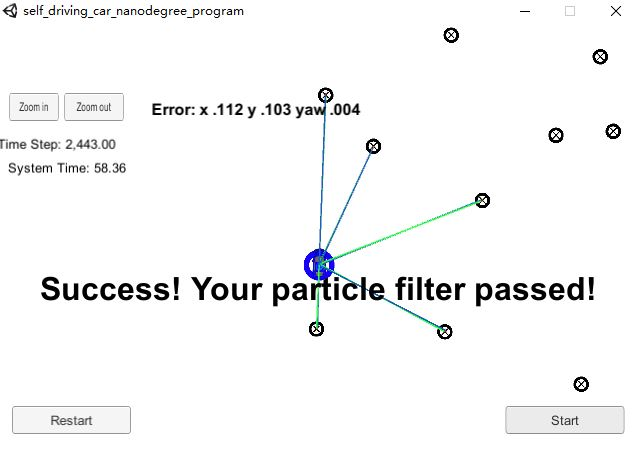
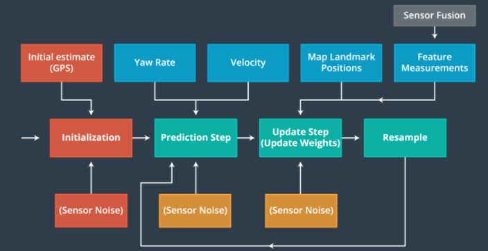
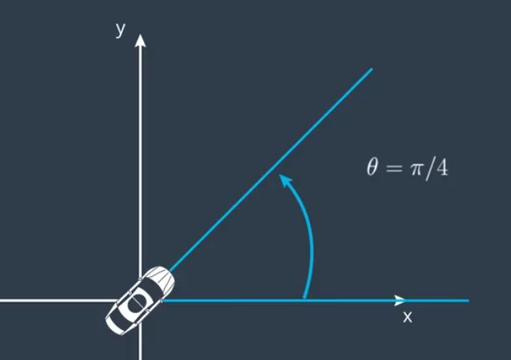
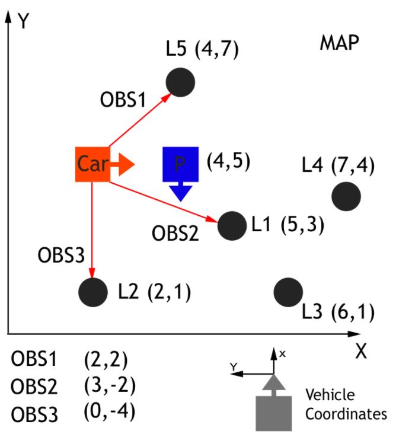

# Kidnapped Vehicle Project
Self-Driving Car Engineer Nanodegree Program



## Overview
This repository contains all the code needed to complete the final project for the Localization course in Udacity's Self-Driving Car Nanodegree.

## Project Introduction
Our robot has been kidnapped and transported to a new location! Luckily it has a map of this location, a (noisy) GPS estimate of its initial location, and lots of (noisy) sensor and control data.

In this project we will implement a 2 dimensional particle filter in C++. Our particle filter will be given a map and some initial localization information (analogous to what a GPS would provide). At each time step our filter will also get observation and control data.

Note : If the math formula shows an exception, you can view the pdf version of [Readme](./Readme.pdf)

## Write Up

Particle Filter Flowchart



### Initialization

The way to initialize our particles is to make an initial estimate using GPS inputs.The particles shall be created by samping a Gaussian distribution and taking into account Gaussian sensor noise around the initial GPS position.

### Prediction

Bicycle Model



If $\dot{\theta} = 0 $,then

$ x_f = x_0 + v(dt)(cos(\theta_0)) $

$ y_f = y_0 + v(dt)(sin(\theta_0)) $

$ \theta_f = \theta_0 $


If $\dot{\theta} \neq 0 $, then

$ x_f = x_0 + \frac{v}{\dot{\theta}}[sin(\theta_0 + \dot{\theta}(dt)) - sin(\theta_0)] $

$ y_f = y_0 + \frac{v}{\dot{\theta}}[cos(\theta_0) - cos(\theta_0 + \dot{\theta}(dt))] $

$ \theta_f = \theta_0 + \dot{\theta}(dt) $

**$x_f,y_f$**: Final x,y position

**$\theta_f$**: Fianl yaw

**$x_0,y_0,\theta_0$**: The initial value of x,y and $\theta$

**dt** : Time elapsed

**v**: Velocity

**$\dot{\theta}$**: Yaw rate

### Update Weights

Map with Car Observations and Particle



Homogenous Transformation

$$ \begin{bmatrix} x_m \\ y_m \\ 1 \end{bmatrix}  = \begin{bmatrix} cos{\theta}& -sin{\theta} & x_p \\ sin{\theta} & cos{\theta} & y_p \\ 0 & 0 & 1 \end{bmatrix}  \times \begin{bmatrix} x_c \\ y_c \\ 1 \end{bmatrix} $$

Association Solution

In order to associate particles,we will use the Euclidan distance to find the nearest landmark to each transformed observation.

$$ distance = \sqrt{(x_{obs} - x_{landmark})^2 + (y_{obs} - y_{landmark})^2} $$

Particle Weight

The Multivariate-Gaussian probability density has two dimensions, x and y. The mean of the Multivariate-Gaussian is the measurement's associated landmark position and the Multivariate-Gaussian's standard deviation is described by our initial uncertainty in the x and y ranges. The Multivariate-Gaussian is evaluated at the point of the transformed measurement's position.

$$ P(x,y) = \frac{1}{2\pi\sigma_x\sigma_y} e^{-(\frac{(x-\mu_x)^2}{2\sigma_x^2} + \frac{(y-\mu_y)^2}{2\sigma_y^2})} $$

* $\sigma_x,\sigma_y$ : landmark measurement uncertainty
* x,y : the observations in map coordinates
* $\mu_x,\mu_y$: the coordinates of the nearest landmarks


### Resample

The way to resample the particles is to use [discrete distribution](https://en.cppreference.com/w/cpp/numeric/random/discrete_distribution)

```C++

    double index_sample;
    default_random_engine gen;
    std::discrete_distribution<> d{std::begin(weights),std::end(weights)};
    for (int i=0;i< num_particles;i++){

        index_sample = d(gen);
        particles_resample.push_back(particles[index_sample]);
    }

    // update the particles
    particles = particles_resample;
```


## Running the Code
This project involves the Term 2 Simulator which can be downloaded [here](https://github.com/udacity/self-driving-car-sim/releases)

Once the install for uWebSocketIO is complete, the main program can be built and ran by doing the following from the project top directory.

1. mkdir build
2. cd build
3. cmake ..
4. make
5. ./particle_filter

Alternatively some scripts have been included to streamline this process, these can be leveraged by executing the following in the top directory of the project:

1. ./clean.sh
2. ./build.sh
3. ./run.sh


Here is the main protocol that main.cpp uses for uWebSocketIO in communicating with the simulator.

INPUT: values provided by the simulator to the c++ program

* sense noisy position data from the simulator :` ["sense_x"],["sense_y"],["sense_theta"]`

* get the previous velocity and yaw rate to predict the particle's transitioned state :`["previous_velocity"] , ["previous_yawrate"]`

* receive noisy observation data from the simulator, in a respective list of x/y values :`["sense_observations_x"] ["sense_observations_y"]`

OUTPUT: values provided by the c++ program to the simulator

* best particle values used for calculating the error evaluation : `["best_particle_x"],["best_particle_y"],["best_particle_theta"]`

* Optional message data used for debugging particle's sensing and associations

* for respective (x,y) sensed positions ID label :`["best_particle_associations"]`

* for respective (x,y) sensed positions :

`["best_particle_sense_x"] <= list of sensed x positions`

`["best_particle_sense_y"] <= list of sensed y positions `
